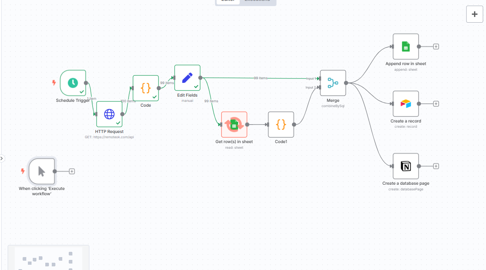
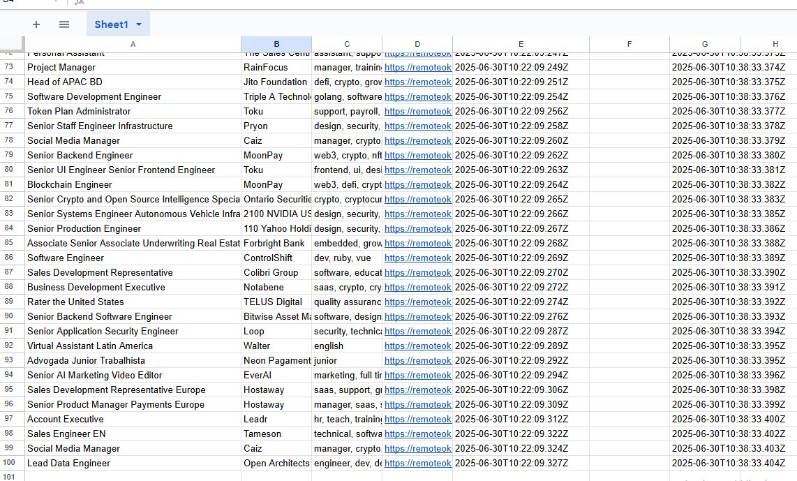
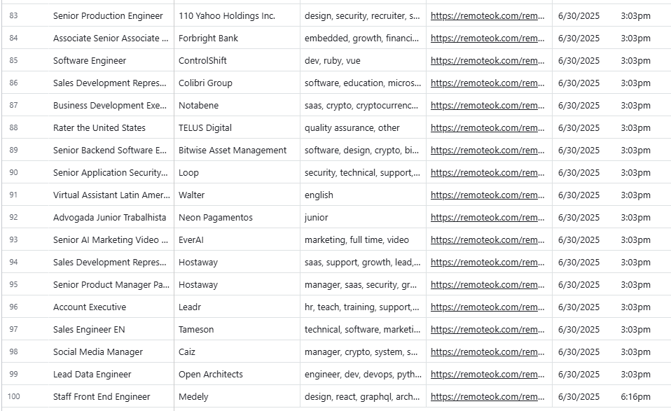
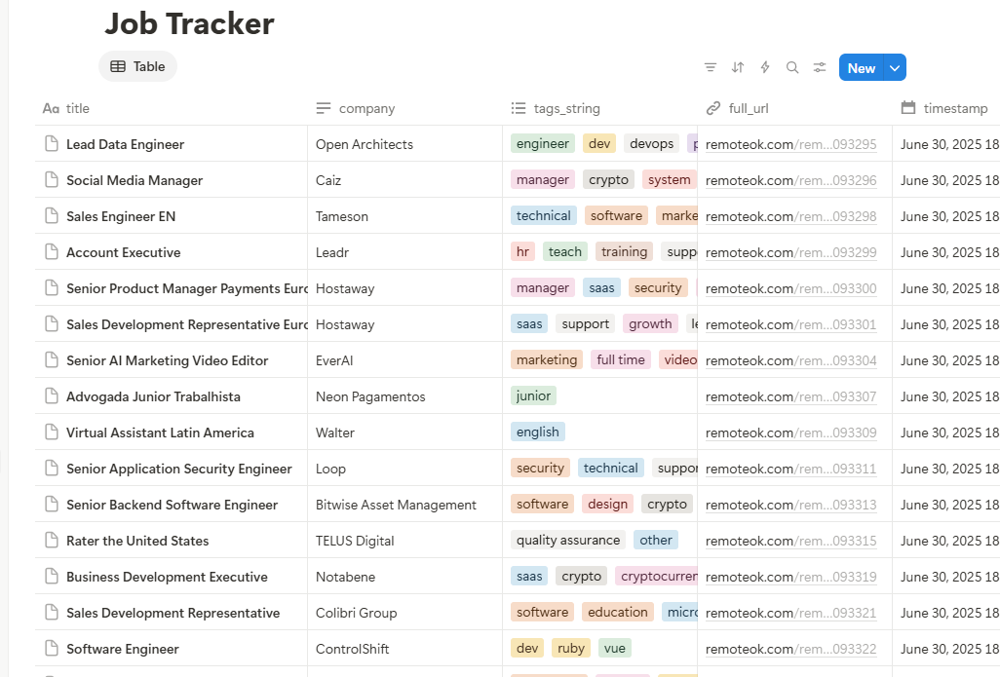

# 🧠 n8n Job Tracker Automation (RemoteOK + Google Sheets + Airtable + Notion)

Track and manage job leads scraped from RemoteOK in one centralized workflow — powered by [n8n](https://n8n.io).

## 🔧 What It Does

- Scrapes the latest jobs from [RemoteOK](https://remoteok.com)
- Deduplicates entries using SQL Merge
- Saves jobs to:
  - 📄 Google Sheets
  - 📋 Airtable
  - 📒 Notion
- Adds `status` and `last_synced` columns for tracking
- Schedule-based or manual execution

## 💡 Features

- API scraping via HTTP Request
- Timestamp and tag formatting
- Filter out already saved jobs
- Multi-platform sync
- Extendable for alerts or resume tracking

## 🛠️ Tools Used

| Tool | Purpose |
|------|--------|
| [n8n](https://n8n.io) | Core automation workflow |
| Google Sheets | Job record storage |
| Airtable | Visual filtering & tagging |
| Notion | Central dashboard |

## 📦 Files Included

- `job-tracker-workflow.json`: n8n workflow (importable)
- `README.md`: this file
- `screenshots/`: Optional UI examples (add yours)

## ✅ Setup Instructions

1. Create a Google Sheet with the following columns:  
   `title`, `company`, `tags_string`, `full_url`, `timestamp`, `status`, `last_synced`

2. Create Airtable & Notion databases with the same fields.

3. Import the `.json` file in n8n → update your credentials.

4. Run the workflow manually or schedule it.

---

✅ Built fully with free, open-source tools.  
🎯 Great fit for Upwork automation jobs, data sync, and scraping projects.

## 📸 Screenshots

| n8n Workflow | Google Sheets | Airtable | Notion |
|--------------|----------------|----------|--------|
|  |  |  |  |

