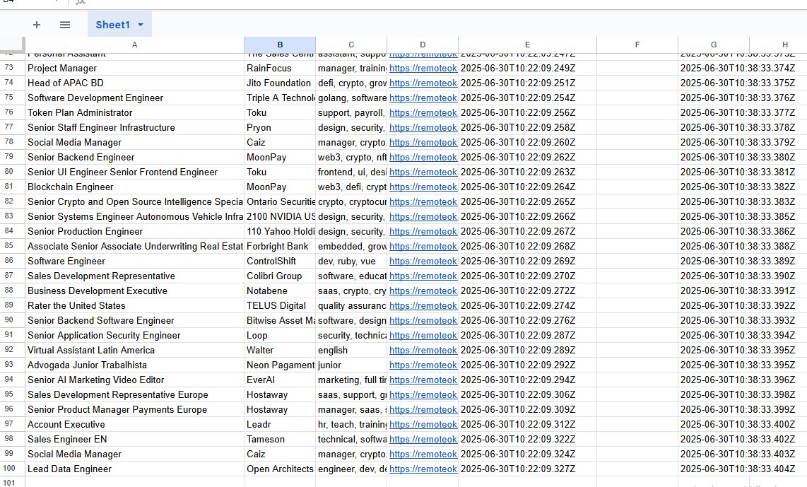
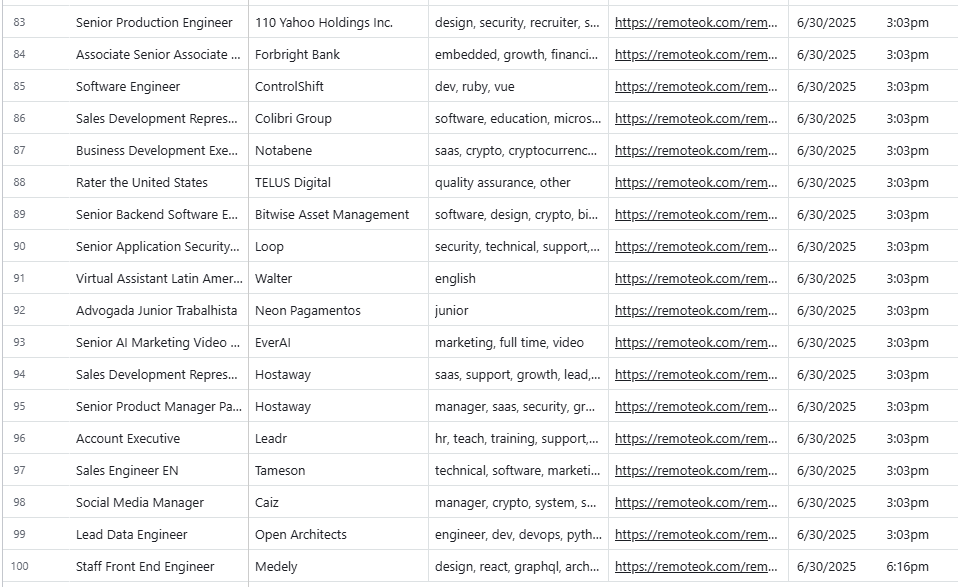
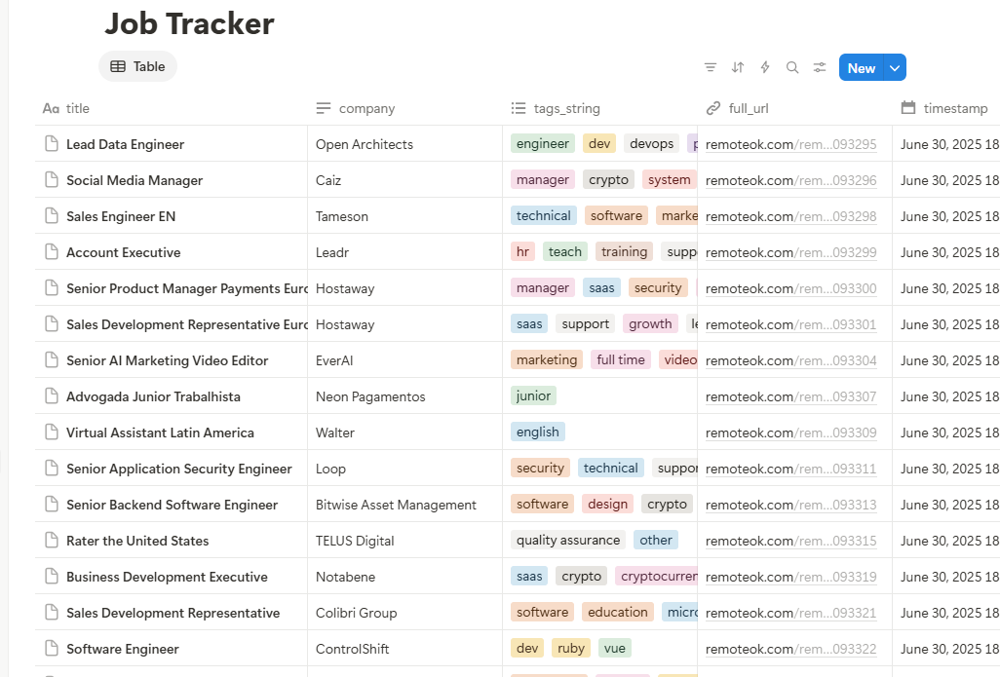
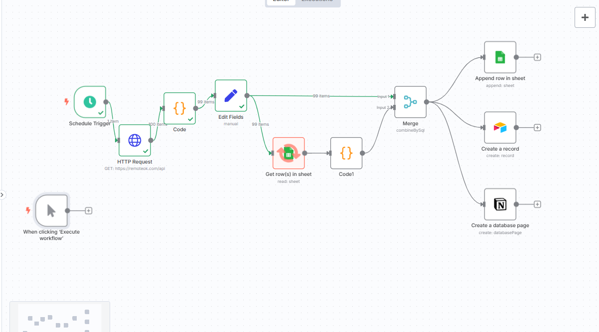

# 🧠 n8n Job Tracker Automation (RemoteOK + Google Sheets + Airtable + Notion)

Track and manage job leads scraped from RemoteOK — all in one automated system, powered by **n8n**.

---

## 🔧 What It Does

- Scrapes latest remote jobs from [RemoteOK](https://remoteok.com)
- Deduplicates entries using SQL Merge
- Saves data to:
  - 📄 Google Sheets
  - 📋 Airtable
  - 📒 Notion
- Adds `status` and `last_synced` columns for tracking
- Can run manually or via schedule trigger

---

## 💡 Features

- API scraping via HTTP Request
- Timestamping and clean tag formatting
- Filters out already saved jobs
- Multi-platform sync (GSheets, Airtable, Notion)
- Easily extendable (e.g. add resume tracking or Slack alerts)

---

## 🛠️ Tools Used

| Tool           | Purpose                          |
|----------------|----------------------------------|
| **n8n**        | Automation engine                |
| **Google Sheets** | Job data storage             |
| **Airtable**   | Visual filtering and tagging     |
| **Notion**     | Unified dashboard view           |

---

## ✅ Setup Instructions

1. **Create a Google Sheet** with the following columns:  
   `title`, `company`, `tags_string`, `full_url`, `timestamp`, `status`, `last_synced`

2. **Create Airtable & Notion databases** with **matching fields** (make sure `tags_string` is multi-select, `timestamp` is date, and `full_url` is a URL field)

3. In n8n:
   - Import the workflow file: `job-tracker-workflow.json`
   - Authenticate your Google Sheets, Airtable, and Notion accounts
   - Update the credentials used in each node

4. Run the workflow manually or schedule it to run daily/hourly.

---

## 🖼️ Screenshots

| Google Sheets | Airtable | Notion | n8n Workflow |
|---------------|----------|--------|--------------|
|  |  |  |  |

---

## 📄 License

MIT
